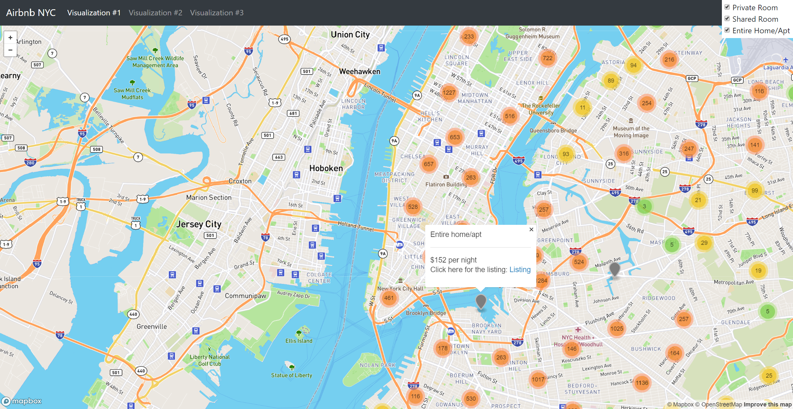
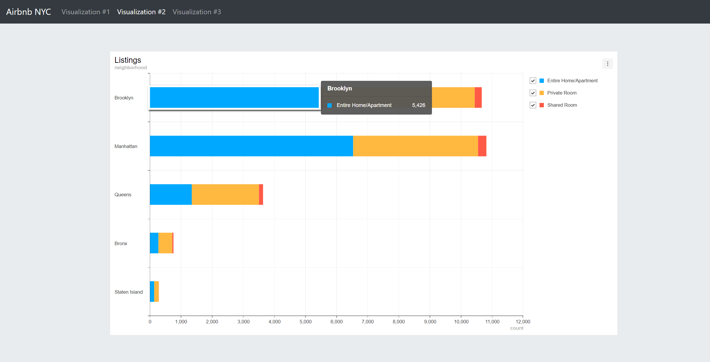
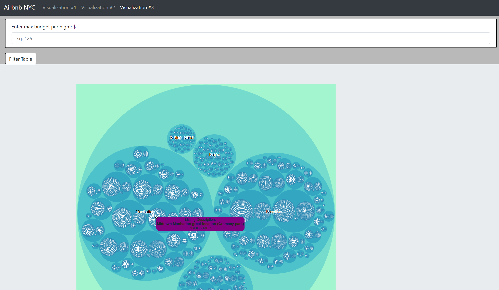

# New York, New York - Selecting an AirBnB location in New York City

## Developers
***
Leonardo Ramirez, Vehonti Apofka, Justin Frank, Araz Ohanessian and Tari Okoya-Koren
***
## Description
***
We took an AirBnB dataset and we have provided some additional ways to visualize the data to assist a user who is considering visiting NYC and wants to use AirBnB.

## Our approach
***
We found a data set from Kaggle.  It was pretty clean but we did take some additional steps to get the data the way we wanted.  We removed some values for listings that were not available for users, but in the dataset. We also removed listings that had not been reviewed by any previous AirBnB users. We dropped a few columns and renamed columns, ended up with about 26k rows of data to work with.  

We created a database using AWS and loaded data to it using Postgres.  Once the data was available, we pulled it using a Flask app we created and had different web pages pulling from the data sources.

## Visualizations

### Map Visualization
Using the Mapbox API and Leaflet this visualization allows the user to see all of New York on a Streetview map. Features include filtering by room type, clicking each listing showing them the price, and a link that will redirect them to the Airbnb listing.

Created by: Leonardo Ramirez

### Stacked Bar Chart
This bar chart shows the count of room types per neighborhood in New York City. The bar chart can be filtered by room type and can be downloaded as a png, jpeg, xls, or csv file. 

Created by: Veohnti Apofka

### Zoom Tree Chart
This tree map shows the details of each listing categorized by neighborhood then boroughs then room type. This tree map can be filtered by price per night and once zoomed in to the listing can be clicked to redirect the user to the Airbnb listing.

Created by: Justin Frank

### Website Details
Used Python3 in a Jupyter Notebook to clean, analyze, and load the data to the cloud. The app was deployed using Python's Flask app library which rendered the webpages. The charts and maps were developed using JavaScript's libraries D3, Leaflet, Plotly, and Toast Chart UI.
Created by: Leonardo Ramirez (Flask app), Tari Okoya-Koren (Flask app, data cleaning, HTML), and Araz Ohanessian (HTML, CSS)

## Data Set Used
***
Kaggle NYC AirBnB Open Data
* http://example.com/https://www.kaggle.com/dgomonov/new-york-city-airbnb-open-data#AB_NYC_2019.csv

Copyright Cantankerous Canines &reg;2020
